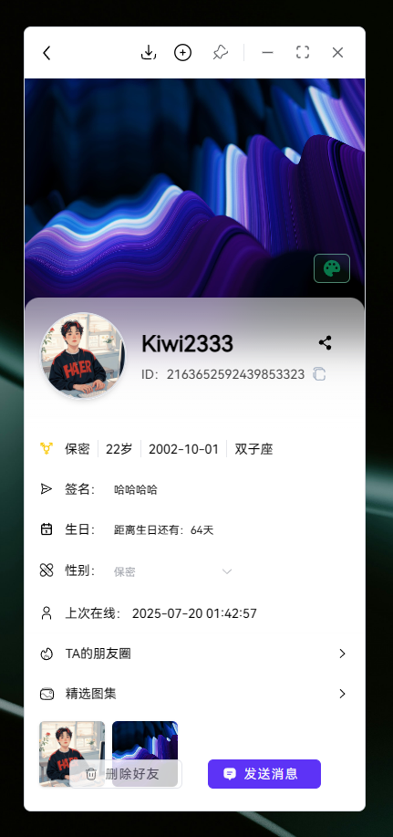
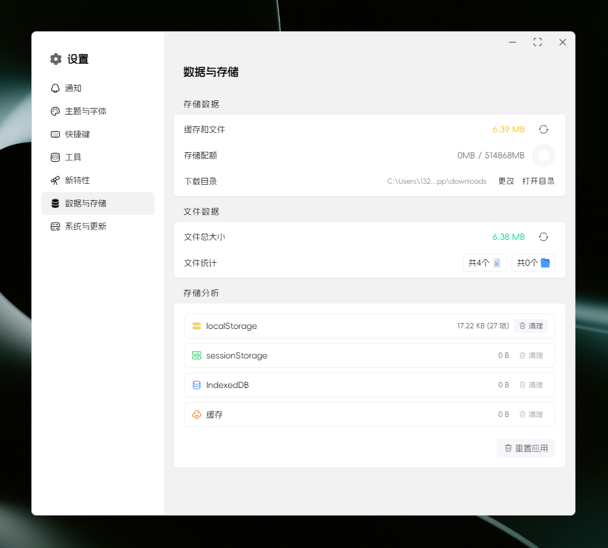
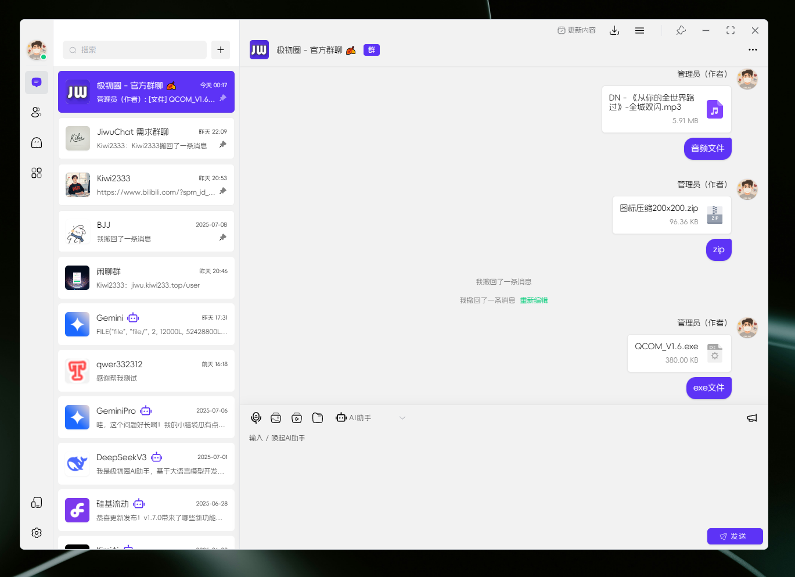
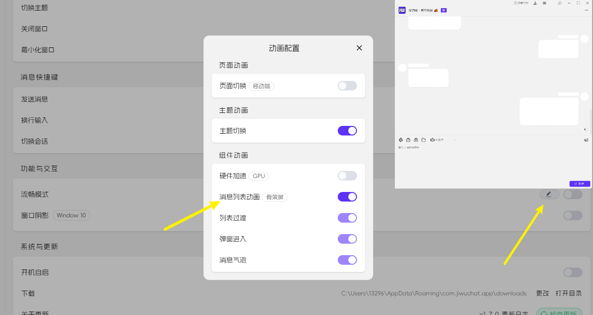
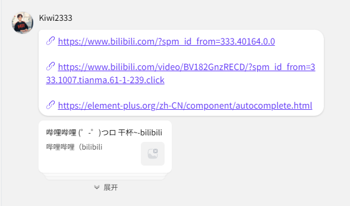
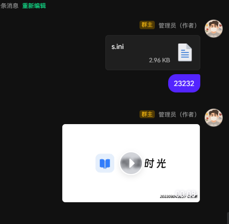

# 1.7.1 版本说明

这是一个重要的功能更新，包含多项界面优化和新功能 🚀

## ✨ 新功能

- [x] feat(user): 重构用户个人中心页面布局和功能，优化信息展示，新增好友管理等功能 ([#ea590b5](https://github.com/KiWi233333/JiwuChat/commit/ea590b5640311e7ae795ec9374f41bb8eaa13151))
- [x] feat(upload): 增加文件上传MIME类型限制，支持多种图片格式，优化上传错误处理 ([#6854ce2](https://github.com/KiWi233333/JiwuChat/commit/6854ce273210ffe74be56a604492fd3507b0b42a))
- [x] feat(chat): 新增消息“群主/管理员”角色显示，优化AT功能 ([#72989a3](https://github.com/KiWi233333/JiwuChat/commit/72989a34034766be1a0611374766cc692fdd891d))
- [x] feat(file): 重构图片、视频、文件等异步发送，新增文件/视频预览卡片，支持文件删除 ([#9a74e87](https://github.com/KiWi233333/JiwuChat/commit/9a74e8724c529a32580209349c7bd865357802aa))
- [x] feat(audio): 增加语音录制、音频流管理、音频设备设置等功能 ([#8c4a068](https://github.com/KiWi233333/JiwuChat/commit/8c4a068e7cee13e93e980106022db02f0e8f19fc))
- [x] feat(components): 优化消息解析和折叠功能，支持多行换行、消息高亮 ([#02d36c9](https://github.com/KiWi233333/JiwuChat/commit/02d36c99558548ab411b547a92994722ef0e622b))

## 🐛 修复了以下问题

- [x] fix(mobiles): 修复移动端目录统计功能，完善 scan_dir_stats 相关实现 ([#4781dc9](https://github.com/KiWi233333/JiwuChat/commit/4781dc9b17fa5c6f548d9899de417ece008ce6ac))
- [x] fix(chat): 优化消息组件和文件上传错误提示，修复消息排序等问题 ([#16cb0a9](https://github.com/KiWi233333/JiwuChat/commit/16cb0a986eea1e329451bbbb4b8ffa6268d98110))
- [x] fix(menu): 修复扩展菜单 loading 状态错误 ([#673ba6a](https://github.com/KiWi233333/JiwuChat/commit/673ba6ae7aa89fe16937efb44d79b7a871a5b841))
- [x] fix(extend): 修复扩展应用打开方式错误，完善权限校验 ([#3aaccbb](https://github.com/KiWi233333/JiwuChat/commit/3aaccbb66a076f6da44ebbd916467afc80717276))

## ⚡ 性能优化

- [x] 优化 useRecording hook，提升音频录制性能 ([#43b23ac](https://github.com/KiWi233333/JiwuChat/commit/43b23ac3a81f97c9c653cdc69dacbfc3e46c331b))
- [x] 优化消息过滤、折叠、解析等流程，提升大消息流畅度 ([#02d36c9](https://github.com/KiWi233333/JiwuChat/commit/02d36c99558548ab411b547a92994722ef0e622b))
- [x] 优化多组件样式和渲染性能 ([#a7313f8](https://github.com/KiWi233333/JiwuChat/commit/a7313f80e5b2cd830d242b1c891a87af78386b14))

## 🎨 界面优化

- [x] style(components): 优化 ContactList、MsgTemplate、Updator 等组件样式 ([#a7313f8](https://github.com/KiWi233333/JiwuChat/commit/a7313f80e5b2cd830d242b1c891a87af78386b14))
- [x] style(setting): 优化菜单和滚动条样式，调整动画效果 ([#85a74f8](https://github.com/KiWi233333/JiwuChat/commit/85a74f8b5b18aa9ea079a8eb1766432326fc3688))
- [x] style(contact): 优化联系人列表样式和布局 ([#b361d4a](https://github.com/KiWi233333/JiwuChat/commit/b361d4a2d061acc1081171a41956afd0f6f7adfc))
- [x] style(Chat): 调整聊天窗口和联系人列表样式 ([#f41356c](https://github.com/KiWi233333/JiwuChat/commit/f41356caf438f577adc8940b4bf11ae66cefb8b2))

## 🔧 构建优化

- [x] build(deps): 升级 Nuxt 4、Element Plus、md-editor-v3、qiniu-js、@tauri-apps/* 等依赖 ([#510ca5b](https://github.com/KiWi233333/JiwuChat/commit/510ca5b4da1ebf952ba5523a372d4d387fcfa0ca))
- [x] build(dependencies): 更新项目依赖并升级部分插件 ([#2446e1a](https://github.com/KiWi233333/JiwuChat/commit/2446e1a84241cbdd384f61d5c13f52b26ff9e3a4))

## 📝 其他优化

- [x] refactor(path): 根据 Nuxt4 新目录重构项目结构 ([#0bd5be8](https://github.com/KiWi233333/JiwuChat/commit/0bd5be83e94f11868edbc3b4a7f88937540df271))
- [x] refactor(setting): 重构多标签页主题同步功能 ([#dba058a](https://github.com/KiWi233333/JiwuChat/commit/dba058af2c26784b16382e8ad008c6cbf3a57f8f))
- [x] 优化部分代码结构和开发脚本 ([#bfd70fe](https://github.com/KiWi233333/JiwuChat/commit/bfd70fef4a0c557f527dae0fc9932d2f8879d5ea))

## 🤯 更新描述

- [x] `Nuxt4发布`：项目全面升级 Nuxt4

- [x] `用户中心重构`：全新布局与功能，信息展示更丰富

- [x] `设置页面重构`：交互与视觉全面升级

- [x] `文件上传重构`：支持任意文件类型异步上传

- [x] `消息骨架屏动画`：消息加载体验提升

- [x] `折叠链接`：消息内容支持折叠显示

- [x] `语音消息-麦克风设置`：支持音频设备选择与测试

- [x] `群主管理员标识`：群聊成员角色一目了然

## 📌 待办

- [ ] 七牛OSS迁移Minio
- [ ] 本地消息存储
- [ ] 用户版本埋点
- [ ] 安卓通话悬浮窗（考虑）

## 🧪 下载

| 平台 | 下载地址 |
| --- | --- |
| Windows x86_64 setup | [JiwuChat_1.7.1_x64_zh-CN.setup](https://github.com/KiWi233333/JiwuChat/releases/download/v1.7.1/JiwuChat_1.7.1_x64-setup.exe) |
| Windows x86_64 msi | [JiwuChat_1.7.1_x64_zh-CN.msi](https://github.com/KiWi233333/JiwuChat/releases/download/v1.7.1/JiwuChat_1.7.1_x64_zh-CN.msi) |
| MacOS x64系列 | [JiwuChat_1.7.1_x64.dmg](https://github.com/KiWi233333/JiwuChat/releases/download/v1.7.1/JiwuChat_1.7.1_x64.dmg) |
| MacOS M系列 | [JiwuChat_1.7.1_aarch64.dmg](https://github.com/KiWi233333/JiwuChat/releases/download/v1.7.1/JiwuChat_1.7.1_aarch64.dmg) |
| Android arm64 | [JiwuChat_1.7.1.apk](https://github.com/KiWi233333/JiwuChat/releases/download/v1.7.1/JiwuChat_1.7.1.apk) |
| Linux AppImage | [JiwuChat_1.7.1_amd62.AppImage](https://github.com/KiWi233333/JiwuChat/releases/download/v1.7.1/JiwuChat_1.7.1_amd64.AppImage) |
| Linux RPM | [JiwuChat_1.7.1.x86_64.rpm](https://github.com/KiWi233333/JiwuChat/releases/download/v1.7.1/JiwuChat-1.7.1-1.x86_64.rpm) |
| Linux DEB | [JiwuChat_1.7.1_amd64.deb](https://github.com/KiWi233333/JiwuChat/releases/download/v1.7.1/JiwuChat_1.7.1_amd64.deb) |

- `Android arm64 版本`  安卓下载：

- 其他版本可在Release页面下载。：
**Dowload Link**: [v1.7.1 Release](https://github.com/KiWi233333/JiwuChat/releases/tag/v1.7.1)

- 版本全部变化：
**Version Info**: [Full Changelog](https://github.com/KiWi233333/JiwuChat/compare/v1.7.0...v1.7.1)
感谢大家的支持！❤ `（Star Fork Issue...）`
