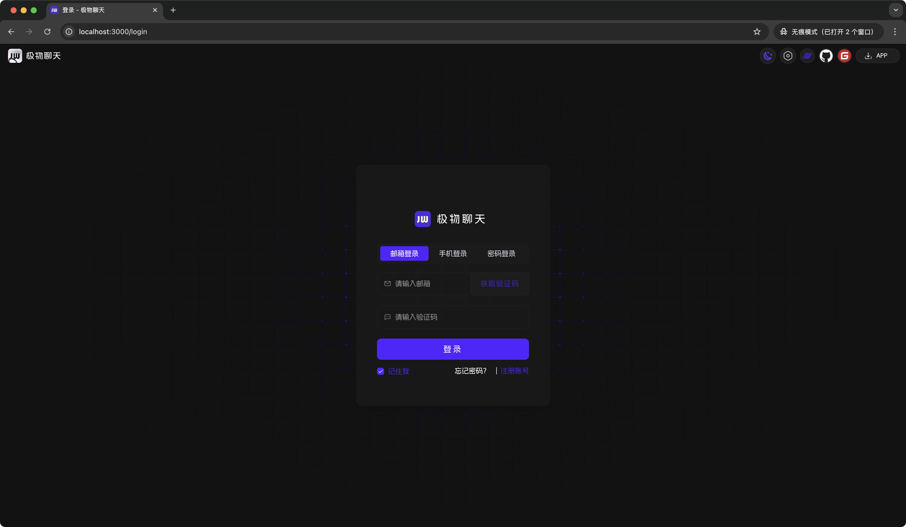
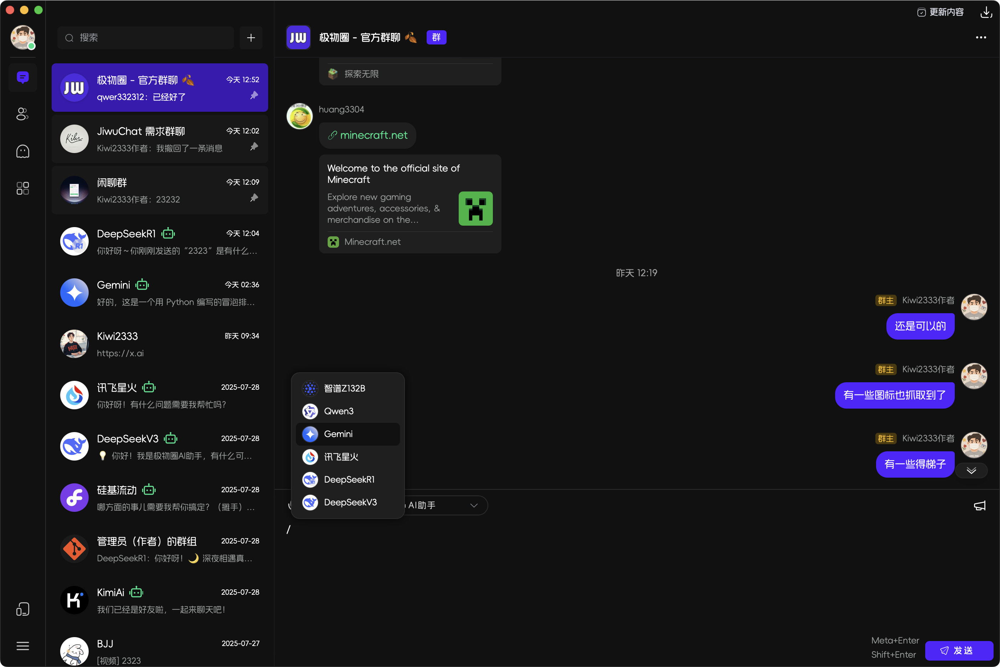

# 1.7.2 版本说明

这是一个重要的功能更新，包含多项界面优化和新功能 🚀

## ✨ 新功能

- [x] feat(login): 重构 Web端 登录页面，调整页面样式 ([#e4d170b7](https://github.com/KiWi233333/JiwuChat/commit/e4d170b74e1e3e7a18efd1421ba817ac75688f81))
- [x] feat(setting): 新增`新消息自然滚动`和动画配置选项 ([#0d8506e3](https://github.com/KiWi233333/JiwuChat/commit/0d8506e3e24e6cf820453c3ebd8103fea6f761ad))
- [x] feat(mac): 添加 macOS 特定配置 ([#9c58089b](https://github.com/KiWi233333/JiwuChat/commit/9c58089be8376e175a63a76a1f5d95f1270d546f))

## 🐛 修复了以下问题

- [x] fix(contact): 修复聊天初始的会话信息缺失的问题 ([#2fe5f9c8](https://github.com/KiWi233333/JiwuChat/commit/2fe5f9c8ecbdd3f1580a35d32a8ac74a16c85e36))
- [x] fix(file): 修复文件拖拽上传错误 ([#d3375199](https://github.com/KiWi233333/JiwuChat/commit/d3375199cbd70c8d3a6bcd5705b1b904b31fed66))

## ⚡ 性能优化

- [x] build: 优化Tauri桌面端构建配置 ([#cfe368f9](https://github.com/KiWi233333/JiwuChat/commit/cfe368f957ae4a266ae3b30247e38c6818ffc2f0))
- [x] build(macOS): 添加 macOS 权限并更新应用配置 ([#b8fafd76](https://github.com/KiWi233333/JiwuChat/commit/b8fafd76d7e36a326f2e744ddcc42a0c34e5b4e9))

## 🎨 界面优化

- [x] style: 优化webkit内核的样式兼容性 ([#6d1c3bea](https://github.com/KiWi233333/JiwuChat/commit/6d1c3bea6b9dfa0890d3444cff1e76514a3c0102))
- [x] style(macOS): 优化标题栏样式并添加重载功能 ([#0952dc1e](https://github.com/KiWi233333/JiwuChat/commit/0952dc1e115935af72851f55de10c8af668735d7))
- [x] style(image): 优化图片查看器工具栏样式 ([#13289dd5](https://github.com/KiWi233333/JiwuChat/commit/13289dd536e1caca689180731b93474ad021073b))
- [x] style(menu): 调整菜单栏最小高度 ([#9de388db](https://github.com/KiWi233333/JiwuChat/commit/9de388db79998c775416fc56edd421a2c2ad14b5))

## 🤯 更新说明

- [x] **Web端新登录页**: 全新Web端 - 登录界面 🎉
      
- [x] **macOS 新UI和兼容性优化**：全面适配 macOS 系统，包括窗口标题栏样式、交通灯设置、权限配置等
      
- [x] **WebKit 内核兼容性**：优化了多个组件在 WebKit 内核下的显示效果和交互体验
- [x] **模块化重构**：重构了聊天存储模块，采用模块化结构提高代码可维护性
- [x] **动画配置增强**：新增消息滚动动画设置和自定义动画配置选项

## 🔧 构建优化

- [x] build(deps): 更新依赖并配置 Android 开发主机 ([#74f7c98b](https://github.com/KiWi233333/JiwuChat/commit/74f7c98b35db029d0b7e4bbbb3d6afd8e60c0bd4))
- [x] build(desps): 添加代码检查插件 ([#42e1def9](https://github.com/KiWi233333/JiwuChat/commit/42e1def9b71f6b6b87ef7dd2440cd1fb8b7ed0ca))
- [x] build(deps): 更新项目依赖版本 ([#3fb9074b](https://github.com/KiWi233333/JiwuChat/commit/3fb9074bed62cb1e14756042e2d0774b22d42d04))
- [x] build(deps): 升级项目基础依赖 ([#191fe2de](https://github.com/KiWi233333/JiwuChat/commit/191fe2ded491e9510fff5337d1d33b68021a6c6c))

## 📝 其他优化

- [x] refactor(hooks): 优化文件操作和音频相关webkit兼容性 ([#e875382b](https://github.com/KiWi233333/JiwuChat/commit/e875382b9fe28dc0a1eee8226df0dc2154ad8a96))
- [x] refactor(layout): 优化页面布局和样式 ([#2699f70d](https://github.com/KiWi233333/JiwuChat/commit/2699f70db59ce9ac501f095272e8191fc3f84922))
- [x] refactor(api): 优化文件操作路径处理逻辑 ([#2aa6c25d](https://github.com/KiWi233333/JiwuChat/commit/2aa6c25d305d9622dacc5989604536391a6de9a9))
- [x] refactor(store): 重构useChatStore模块，优化为模块化结构 ([#a460ab88](https://github.com/KiWi233333/JiwuChat/commit/a460ab88ec81ed6773163b3056798a430dcca212))
- [x] refactor(components): 重构好友/群组列表组件统一处理 ([#37ee1c88](https://github.com/KiWi233333/JiwuChat/commit/37ee1c884746f1459cb305611e8a8d52484a93ba))
- [x] refactor(login): 重构 Web端 登录页面 ([#e4d170b7](https://github.com/KiWi233333/JiwuChat/commit/e4d170b74e1e3e7a18efd1421ba817ac75688f81))
- [x] refactor(os): 优化多平台文件路径适配 ([#6b6d8f9f](https://github.com/KiWi233333/JiwuChat/commit/6b6d8f9fdc8ab98e9d286534bcaef5ad8c87f192))
- [x] refactor(app): 优化消息发送逻辑和按钮状态 ([#7de35b39](https://github.com/KiWi233333/JiwuChat/commit/7de35b396e546647b19087cff2336080551bb3f5))
- [x] refactor(components): 优化多个组件的显示和交互细节 ([#0b5a14dd](https://github.com/KiWi233333/JiwuChat/commit/0b5a14dd3b4b79750dceafbe7cfad1171d5d717d))

## 📌 待办

- [ ] 七牛OSS迁移Minio
- [ ] 本地消息存储
- [ ] 用户版本埋点
- [ ] 安卓通话悬浮窗（考虑）

## 🧪 下载

| 平台                 | 下载地址                                                                                                                       |
| -------------------- | ------------------------------------------------------------------------------------------------------------------------------ |
| Windows x86_64 setup | [JiwuChat_1.7.2_x64_zh-CN.setup](https://github.com/KiWi233333/JiwuChat/releases/download/v1.7.2/JiwuChat_1.7.2_x64-setup.exe) |
| Windows x86_64 msi   | [JiwuChat_1.7.2_x64_zh-CN.msi](https://github.com/KiWi233333/JiwuChat/releases/download/v1.7.2/JiwuChat_1.7.2_x64_zh-CN.msi)   |
| MacOS x64系列        | [JiwuChat_1.7.2_x64.dmg](https://github.com/KiWi233333/JiwuChat/releases/download/v1.7.2/JiwuChat_1.7.2_x64.dmg)               |
| MacOS M系列          | [JiwuChat_1.7.2_aarch64.dmg](https://github.com/KiWi233333/JiwuChat/releases/download/v1.7.2/JiwuChat_1.7.2_aarch64.dmg)       |
| Android arm64        | [JiwuChat_1.7.2.apk](https://github.com/KiWi233333/JiwuChat/releases/download/v1.7.2/JiwuChat_1.7.2.apk)                       |
| Linux AppImage       | [JiwuChat_1.7.2_amd64.AppImage](https://github.com/KiWi233333/JiwuChat/releases/download/v1.7.2/JiwuChat_1.7.2_amd64.AppImage) |
| Linux RPM            | [JiwuChat_1.7.2.x86_64.rpm](https://github.com/KiWi233333/JiwuChat/releases/download/v1.7.2/JiwuChat-1.7.2-1.x86_64.rpm)       |
| Linux DEB            | [JiwuChat_1.7.2_amd64.deb](https://github.com/KiWi233333/JiwuChat/releases/download/v1.7.2/JiwuChat_1.7.2_amd64.deb)           |

- `Android arm64 版本` 安卓下载：

- 其他版本可在Release页面下载。：
  **Dowload Link**: [v1.7.2 Release](https://github.com/KiWi233333/JiwuChat/releases/tag/v1.7.2)

- 版本全部变化：
  **Version Info**: [Full Changelog](https://github.com/KiWi233333/JiwuChat/compare/v1.7.1...v1.7.2)
  感谢大家的支持！❤ `（Star Fork Issue...）`
