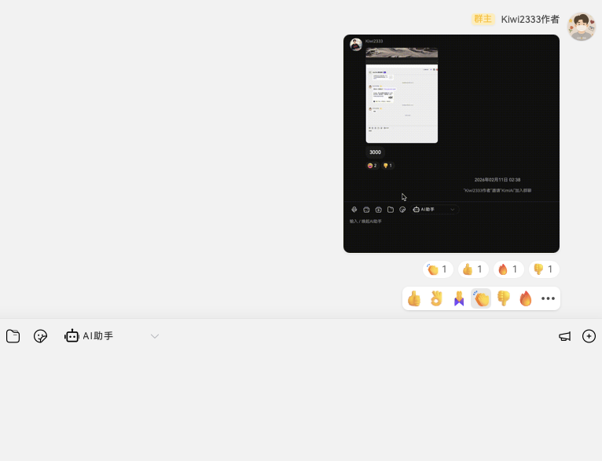
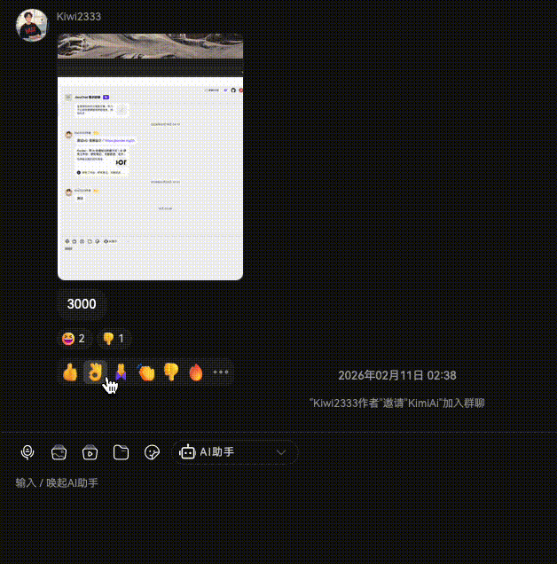
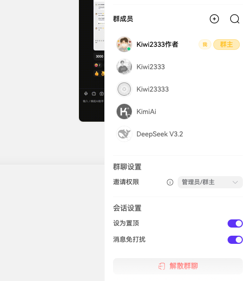

# 1.8.2 版本说明

本版本为 1.8.1 之后的修订更新，主要包含消息表情回应（emoji）、群聊邀请权限控制、剪贴板与粘贴增强、全局图片预览与路由/媒体重构，以及若干修复与样式优化。更新摘要如下。

## ✨ 新功能

- [x] feat(reaction): 添加消息表情回应（emoji）功能 ([#27f54431](https://github.com/KiWi233333/JiwuChat/commit/27f5443170614b629a78b7ddfc00eb4c69cdf7bf))
- [x] feat(clipboard): 使用统一剪贴板工具替换原有剪切板相关功能 ([#cd360717](https://github.com/KiWi233333/JiwuChat/commit/cd3607177c116bb0732fcd9156d3bddc9b8d8c4b))
- [x] feat(chat): 增强粘贴功能以支持自定义 token 解析 ([#8ed5e94d](https://github.com/KiWi233333/JiwuChat/commit/8ed5e94d00a6a9ecdf7dd423112ecf5dd6c50a56))
- [x] feat(chat): 添加群聊邀请权限控制功能 ([#3811ad23](https://github.com/KiWi233333/JiwuChat/commit/3811ad2339912f3882c2cc2e2fb96b51bc899a4e))

## 🐛 修复了以下问题

- [x] fix(desktop): 更新 macOS 应用恢复逻辑 ([#7d3b19d1](https://github.com/KiWi233333/JiwuChat/commit/7d3b19d17843ecfa772a60466b5a3f4fe62a5365))
- [x] fix(chat): 更新联系人列表搜索框的 v-model 绑定方式 ([#7a82f073](https://github.com/KiWi233333/JiwuChat/commit/7a82f0732fa3dd38f720918f8c70de9504461311))
- [x] fix(chat): 修复联系人列表暗黑模式背景色问题 ([#2c540140](https://github.com/KiWi233333/JiwuChat/commit/2c5401404c39d2f9b95ad09f83856e40849fbf5e))

## ⚡ 性能优化

- [x] perf(desktop): 修改 macOS 程序坞点击事件处理 ([#dd4fec98](https://github.com/KiWi233333/JiwuChat/commit/dd4fec983b58cda16fa487c3a3771393ec151064))
- [x] perf(history): 改进路由变化监听逻辑以支持栈中间前进/回退 ([#5706b482](https://github.com/KiWi233333/JiwuChat/commit/5706b4826cab39e2277198b3dbad6ba5b46e5de7))
- [x] perf(image-viewer): 添加全局图片预览功能并优化路由拦截逻辑 ([#2b5a0b78](https://github.com/KiWi233333/JiwuChat/commit/2b5a0b784bf3ce681dc0dae6b7dde11fbb5ce61b))

## 🎨 界面优化

- [x] style(reaction): 更新消息表情回应样式 ([#2573776a](https://github.com/KiWi233333/JiwuChat/commit/2573776ab04705529c230ed24bf6a4872f941833))
- [x] style(components): 头部菜单优化 ([#d26c9cd4](https://github.com/KiWi233333/JiwuChat/commit/d26c9cd4f6766a25617b4f6893a3e8bb0f98ecf4))
- [x] style(app): 调整样式覆盖和组件文本优化 ([#f934f158](https://github.com/KiWi233333/JiwuChat/commit/f934f158a419d4da25538c3d2edc1c554fe306c8))

## 📝 其他优化

- [x] refactor(msg-input): 移除不必要的导出，简化代码结构 ([#59a5e7a1](https://github.com/KiWi233333/JiwuChat/commit/59a5e7a133018dfae0a5f19fd6b77b0dbb101a5e))
- [x] refactor(router): 增加 scope 配置项支持全局和局部作用域 ([#288eb1b9](https://github.com/KiWi233333/JiwuChat/commit/288eb1b99367e23c080f3549396c8dcff3f64cc9))
- [x] refactor(media): 重构媒体管理器以支持统一的插入逻辑 ([#35f07509](https://github.com/KiWi233333/JiwuChat/commit/35f075096a7b4b8d32c8618d98d7750897b28a23))
- [x] chore: 更新 .gitignore 文件 ([#3a4189df](https://github.com/KiWi233333/JiwuChat/commit/3a4189df5fad143d33a0bda2a5838b2c2ec18bb7))
- [x] chore(docs): 更新项目规范文档，调整表格格式和内容清晰度 ([#e8c527db](https://github.com/KiWi233333/JiwuChat/commit/e8c527db11bc1f9f2f66530eb8fd6f794a362752))
- [x] docs(run): 添加关于 Cursor 开发的说明及可用命令和 Skill 列表 ([#07993580](https://github.com/KiWi233333/JiwuChat/commit/0799358072a08da18cf4e654e627b821e8518b2b))
- [x] docs(release): 添加 v1.8.2 版本发布相关图片资源 ([#f4033d75](https://github.com/KiWi233333/JiwuChat/commit/f4033d751628e1e88dcb9e77455afb0ca531f84f))

## 🤯 更新说明

- [x] **消息表情回应**：支持对单条消息添加 emoji 回应，并优化展示样式与动效。

- [x] **群聊邀请权限**：群聊支持邀请权限控制，管理员可配置谁可以邀请新成员。

- [x] **剪贴板与粘贴**：统一剪贴板工具、粘贴支持自定义 token 解析；媒体管理器重构，插入逻辑统一。
- [x] **体验与修复**：全局图片预览与路由拦截优化；路由监听支持栈中间前进/回退；macOS 程序坞点击与应用恢复逻辑更新；联系人列表搜索绑定与暗黑模式背景修复；头部菜单与样式优化。

## 📌 待办

- [ ] 七牛OSS迁移Minio
- [ ] 本地消息存储
- [ ] 用户版本埋点
- [ ] 安卓通话悬浮窗（考虑）

## 🧪 下载

| 平台                 | 下载地址                                                                                                                       |
| -------------------- | ------------------------------------------------------------------------------------------------------------------------------ |
| Windows x86_64 setup | [JiwuChat_1.8.2_x64_zh-CN.setup](https://github.com/KiWi233333/JiwuChat/releases/download/v1.8.2/JiwuChat_1.8.2_x64-setup.exe) |
| Windows x86_64 msi   | [JiwuChat_1.8.2_x64_zh-CN.msi](https://github.com/KiWi233333/JiwuChat/releases/download/v1.8.2/JiwuChat_1.8.2_x64_zh-CN.msi)   |
| MacOS x64系列        | [JiwuChat_1.8.2_x64.dmg](https://github.com/KiWi233333/JiwuChat/releases/download/v1.8.2/JiwuChat_1.8.2_x64.dmg)               |
| MacOS M系列          | [JiwuChat_1.8.2_aarch64.dmg](https://github.com/KiWi233333/JiwuChat/releases/download/v1.8.2/JiwuChat_1.8.2_aarch64.dmg)       |
| Android arm64        | [JiwuChat_1.8.2.apk](https://github.com/KiWi233333/JiwuChat/releases/download/v1.8.2/JiwuChat_1.8.2.apk)                       |
| Linux AppImage       | [JiwuChat_1.8.2_amd64.AppImage](https://github.com/KiWi233333/JiwuChat/releases/download/v1.8.2/JiwuChat_1.8.2_amd64.AppImage) |
| Linux RPM            | [JiwuChat_1.8.2.x86_64.rpm](https://github.com/KiWi233333/JiwuChat/releases/download/v1.8.2/JiwuChat-1.8.2-1.x86_64.rpm)       |
| Linux DEB            | [JiwuChat_1.8.2_amd64.deb](https://github.com/KiWi233333/JiwuChat/releases/download/v1.8.2/JiwuChat_1.8.2_amd64.deb)           |

- `Android arm64 版本` 安卓下载：

- 其他版本可在 Release 页面下载。： **Dowload Link**: [v1.8.2 Release](https://github.com/KiWi233333/JiwuChat/releases/tag/v1.8.2)

- 版本全部变化： **Version Info**: [Full Changelog](https://github.com/KiWi233333/JiwuChat/compare/v1.8.1...v1.8.2) 感谢大家的支持！❤ `（Star Fork Issue...）`
